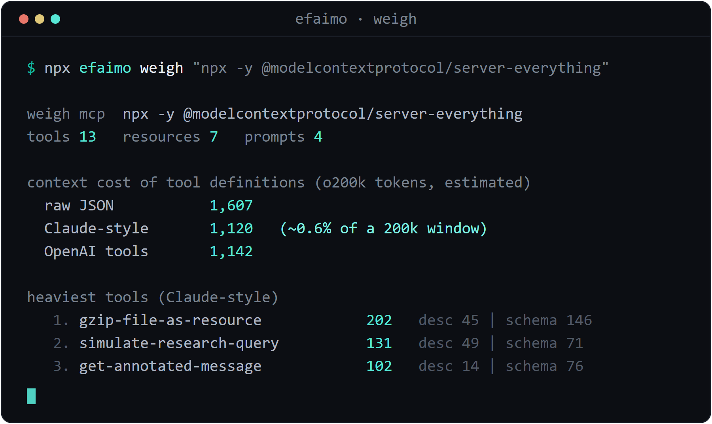
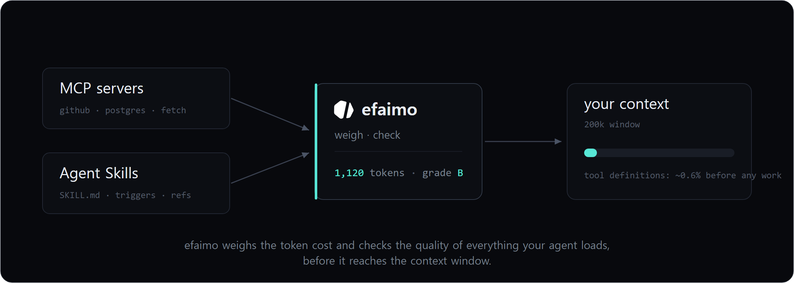

<p align="center">
  
</p>

<p align="center">
  <a href="https://github.com/efaimo-ai/efaimo/actions/workflows/ci.yml"></a>
  <a href="https://www.npmjs.com/package/efaimo"></a>
  <a href="./LICENSE"></a>
  = 22">
</p>

<p align="center">
  <b>efaimo</b> audits everything your agent loads: <b>MCP servers</b> and <b>Agent Skills</b>.<br>
  One CLI lints them, weighs their context cost, diffs servers against the 2026-07-28 spec,<br>
  and A/B-tests whether a skill actually helps.
</p>

Everything you plug into an agent spends two budgets before any work happens:
context-window tokens, and the trigger quality that decides whether the right tool
fires at all. Good tools exist for single slices of that problem; efaimo's job is
the whole audit in one command, for both halves of what an agent loads. Lint a
skill, weigh a server's tool definitions, get a migration diff for the 2026-07-28
stateless MCP spec, and measure whether a skill actually improves task completion
([SkillsBench](https://www.skillsbench.ai) found 16 of 84 curated skills making
agents worse; linting alone cannot catch that).

## Agent Skills

```bash
npx efaimo check --skill ./skills/
```

Point it at one skill or a whole folder. It validates each skill against the
[agentskills.io](https://agentskills.io) spec and grades it:

```text
check skill  claude-api
grade C (71)   1 error  2 warnings  4 info

  x S101  description is 1068 chars (spec max 1024)
  ! S104  instructions are ~18.4k tokens (spec recommends staying under 5k)
          fix: move detail into references/ files loaded on demand
  ! S104  SKILL.md is 570 lines (spec recommends under 500)
  i S104  metadata level is ~294 tokens; the spec targets ~100 and this loads at
          startup for every installed skill
```

*(That is Anthropic's own `claude-api` skill.)* efaimo checks frontmatter and
trigger quality, collisions across an installed set, the context budget (metadata
loaded every session, body loaded on trigger), reference integrity, and injection
hygiene. Run it on a folder and every skill gets its own grade, not one aggregate.

**We graded 36 public Agent Skills**: every skill in `anthropics/skills`,
`anthropics/claude-cookbooks`, and `obra/superpowers`, at pinned commits. 97%
score an A, but even this curated set has real issues: Anthropic's own
`claude-api` scores a C with an over-limit description and ~18k-token
instructions, and the median skill's instructions run ~1,700 tokens loaded on
every trigger. Full report, the corpus manifest, and the two commands that
reproduce it: [the Skills Quality Index](./research/skills-index/REPORT.md).

### Does the skill actually help? (experimental)

Linting tells you a skill is well-formed. It does not tell you the skill makes the
agent *better*, and research shows some skills make it worse. `efaimo test` measures
that directly: it runs a task with and without the skill, N trials each, and an LLM
judge scores every attempt.

```bash
npx efaimo test scenario.yaml                 # dry run: validate + show the plan, no API calls
npx efaimo test scenario.yaml --live          # run it for real (Claude or GPT)
npx efaimo test scenario.yaml --live --model gpt-4o-mini
```

Works with Claude (`ANTHROPIC_API_KEY`) or GPT (`OPENAI_API_KEY`) models; the
provider is picked from the model name. Put the key in your shell or a local
`.env` file (copy `.env.example`); a real shell variable always wins.

Two real runs (claude-sonnet-5, 8 trials each) show why this matters. First, a
generic csv-cleanup skill that a capable model does not need:

```text
test  csv-cleanup helps on a messy CSV
  with skill     8/8 pass  (100%)
  without skill  8/8 pass  (100%)
  delta          +0 points   no measurable effect
```

Then a skill that encodes a convention the model cannot guess:

```text
test  contoso-crm-import helps on an unknowable format
  with skill     8/8 pass  (100%)
  without skill  0/8 pass  (0%)
  delta          +100 points   helps
```

Both skills lint clean; their value is opposite. The first is pure context
overhead, the second earns its tokens, and linting cannot tell them apart. `efaimo
test` can. Experimental and probabilistic: raise the trial count for confidence,
and treat small deltas as noise. It is opt-in because a live run spends tokens on
your key. See [examples/scenario.example.yaml](./examples/scenario.example.yaml)
and [examples/scenario.crm.yaml](./examples/scenario.crm.yaml).

## MCP servers

```bash
npx efaimo weigh "npx -y my-mcp-server"      # what does it cost my context window?
npx efaimo check --mcp "npx -y my-server"    # quality grade + 2026-07-28 migration diff
```

`weigh` reports the token cost of tool definitions in three real serializations,
per tool, with an optional `--anthropic` exact Claude count.

<p align="center">
  
</p>

`check --mcp` connects live (it speaks both the legacy handshake and the new
stateless protocol, so a 2026-07-28 server audits fine) and reports two things,
separately. First, a **quality grade** for what models actually experience:
descriptions, schemas, annotations, tool count, token cost. Second, an ungraded
**migration diff** for the 2026-07-28 stateless spec (which removes
`initialize`, sessions, Sampling, Roots, and Logging, and requires
`server/discover`, `resultType`, and cache fields): exactly what will break and
how to fix it, each rule naming the SEP it came from. Readiness never drags the
grade; not having migrated to a spec that is not final until 2026-07-28 is a
to-do list, not a defect. Full list: [docs/RULES.md](./docs/RULES.md).

## From an agent

`efaimo mcp` runs efaimo as a small, read-only MCP server, so an agent can lint or
weigh a skill mid-session, before it commits it to context:

```bash
npx efaimo mcp      # stdio server exposing efaimo_check_skill and efaimo_weigh_skill
```

It reads files only (it spawns no process and opens no socket), and the
token-spending `test` is not exposed. Client config and recipes are in
[docs/INTEGRATIONS.md](./docs/INTEGRATIONS.md).

## How it works

efaimo sits between your agent and everything it loads, measures the cost the way
your host actually serializes it, and grades the quality, before any of it reaches
your context window.

<p align="center">
  
</p>

## How it compares

Focused tools already own single slices of this space, and some are very good.
efaimo is the one tool that covers the whole audit surface. As of mid-2026:

| | efaimo | [skill-validator](https://github.com/agent-ecosystem/skill-validator) | [upskill](https://github.com/huggingface/upskill) | [mcp-spec-check](https://github.com/Roee-Tsur/mcp-spec-check) | [conformance](https://github.com/modelcontextprotocol/conformance) (official) |
|---|---|---|---|---|---|
| Agent Skills linting | yes | yes | no | no | no |
| Skill token cost | yes (3-level split) | yes | no | no | no |
| Skill outcome testing | with/without A/B trials (experimental) | static LLM scoring | yes (generate + eval, code agents) | no | no |
| MCP tool-definition cost | yes (3 serializations, `--anthropic` exact) | no | no | no | no |
| MCP quality rules | yes | no | no | no | no |
| 2026-07-28 readiness | migration diff: what breaks and how to fix | no | no | yes/no verdict | official test suite |
| CI budget gate + badge | yes | no | no | no | no |

efaimo runs the official conformance suite for you (`check --conformance` on
http targets) and complements security scanners such as Snyk agent-scan and the
skills installer (`npx skills`) rather than replacing them.

## Install

Nothing to install. Use `npx`:

```bash
npx efaimo check --skill ./skills/
```

Or add it to a project with `npm i -D efaimo`, or the GitHub Action:

```yaml
- uses: efaimo-ai/efaimo@v0
  with:
    command: check --skill ./skills --strict
```

Gate a pull request on context-window growth, too:

```bash
npx efaimo weigh "npx -y my-server" --out base.json          # record a baseline
npx efaimo weigh "npx -y my-server" --diff base.json --allow-increase 10
```

`--badge badge.svg` writes an SVG plus a shields.io endpoint JSON for your README.
More recipes (pre-commit, GitLab, editor audit, programmatic use):
[docs/INTEGRATIONS.md](./docs/INTEGRATIONS.md).

## Rules at a glance

| family | covers |
|---|---|
| **S101 to S106** | skills: frontmatter and trigger quality, trigger collisions, context budget, reference integrity, injection hygiene |
| **E101 to E118** | MCP 2026-07-28 readiness: deprecated primitives, statelessness, `server/discover`, `resultType`, cache fields, transport |
| **E121 to E130** | MCP quality: description quality, annotations, schema hygiene, tool-count and token-cost budgets |

Quality (E12x-E13x) and skill (S) findings set the letter grade; readiness
findings (E101-E118) are reported as an ungraded migration diff until the spec
ratifies. Every finding carries a stable id you can suppress or link. See
[docs/RULES.md](./docs/RULES.md).

## Roadmap

- Harden `efaimo test`: a separately chosen judge model, confidence intervals on
  the delta, multi-turn tool-use trials, and judge calibration, so the
  experimental harness earns unqualified trust.
- Track the 2026-07-28 spec to ratification, then start grading readiness (today
  it is an ungraded migration diff on purpose).
- A public, continuously updated Agent Skills Quality Index over a broad corpus.

## Stability

efaimo is 0.x. The commands are stable, but the rule set, grades, and exact output
may change between minor versions until 1.0; pin a version in CI if you need
reproducible thresholds. Every finding keeps a stable id.

## Honest scope

efaimo is a linter and cost profiler, not a security scanner. Its injection checks
are info-level heuristics that an attacker evades trivially; a clean report is not a
security pass. For supply-chain safety use a dedicated scanner such as Snyk
agent-scan. Token figures are estimates unless you opt into `--anthropic`; the
method and its known bias are in [docs/METHODOLOGY.md](./docs/METHODOLOGY.md).

## About

Built by [efaimo ai](https://efaimo.ai), open tooling for the space between hosts
and tools. `efaimo` is the flagship CLI; capabilities grow as subcommands under one
name. Apache-2.0. See [CONTRIBUTING.md](./CONTRIBUTING.md) and
[docs/RULES.md](./docs/RULES.md) to add a rule.
